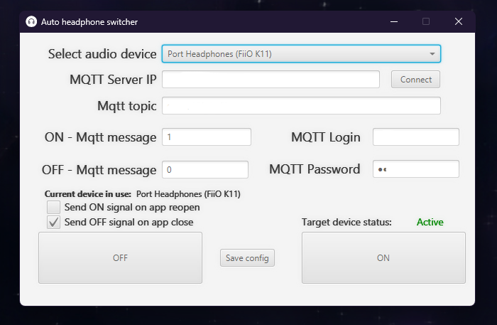

# MQTT Automatic ON/OFF switch for Headphone Power Amplifier K11 - FiiO
This was more for a convenience than anything else.  
This is an engineering approach to a problem that I had with my Headphone Power Amplifier K11 - FiiO.  
Why just press and hold the off button for 5 second to turn it off when you can do it automatically?
So in total i spend around few hours to make an app that will do this for me.

## Coding video

## Time
It took me 10 hours to make this app.
So after 7200 turn on and off, I will be in profit.

## Problem
- The K11 has a power button that you need to press and hold for 5 seconds to turn it off.
- It's annoying to do it every time you want to turn it off.
- When you turn it on, it's always on. You need to turn it off manually.
- I want my pc to turn AMP off automatically when I turn off my pc. So it doesn't stay on all the time.

## Pre-requisites
- [Tasmota](https://tasmota.github.io/docs/) flashed switch.
- MQTT broker.
- [Fioio K11 Headphone Power Amplifier](https://www.fiio.com/k11).
- Fioio K11 Power Amplifier power cable with [Sonoff Basic R2 switch with tasmota](https://tasmota.github.io/docs/devices/Sonoff-Basic/#sonoff-basic-r1).

## Solution
- Use an MQTT client to send a message to tasmota switch to turn it off.
- Use javaFx desktop app to have nice control over send the message to the MQTT broker.
- Use [nirsoft audio switcher](https://www.nirsoft.net/utils/sound_volume_command_line.html) to switch source audio device in window.
- Use custom threading to parallel run process to check currently ran audio source.
- Pack it all in a jar file and run it on startup.

## How to use
- Make sure you do have SDK [liberica-full-23](https://bell-sw.com/pages/downloads/#jdk-23) or above installed.
- Download the jar file from the release.
- Run the jar using bat file.